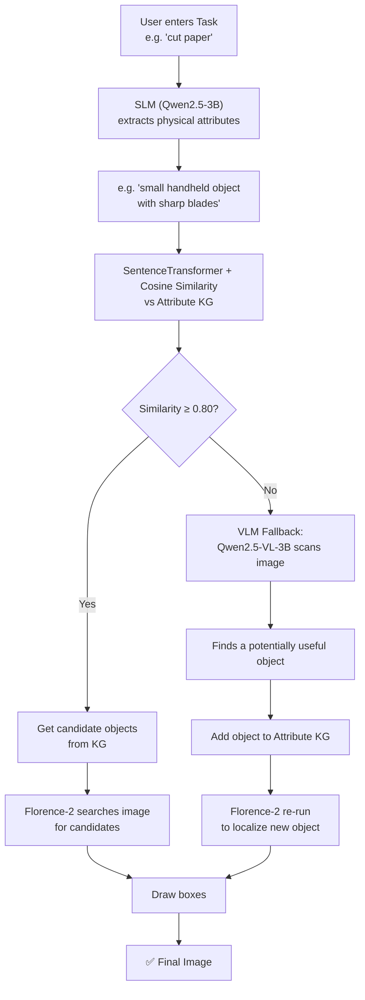
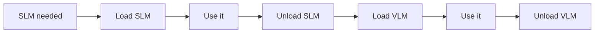

# 📁 Attribute_KG

⬅ [Back to Aditya overview](../README.md)

**What it does:** Instead of keying the graph on the *task name*, it keys on the **physical attributes** the task needs — making the KG reusable across many similar tasks.

## Flow



## Worked example

```
Task: "cut paper"
   ↓ SLM extracts attribute
"small handheld object with sharp blades"
   ↓ matched in Attribute KG
scissors / knife / box cutter
   ↓ Florence-2 locates in image
```

If no attribute matches, the pipeline **doesn't just give up** — the VLM looks at the image directly, finds something useful, and teaches the KG a new attribute → object mapping for next time.

## VRAM management

Three models (SLM, VLM, Florence-2) can't all fit comfortably, so only one Qwen model is loaded at a time:



**Florence-2 stays loaded permanently.** Whole pipeline runs within ~6 GB VRAM using 4-bit quantization.

## Files
| File | Role |
|---|---|
| `kg_vlm_slm_florence_v1.py` | Main pipeline + VRAM swapping |
| `kg_manager.py` | Attribute embedding + matching |
| `attribute_knowledge_graph.json` | Attribute → tool mappings |

## Output
```
attr_kg_output_{image}.jpg
```
Green boxes = KG hits, red boxes = new VLM discoveries.

## Run
```bash
cd Attribute_KG
python kg_vlm_slm_florence_v1.py
# try: "open the parcel"
```