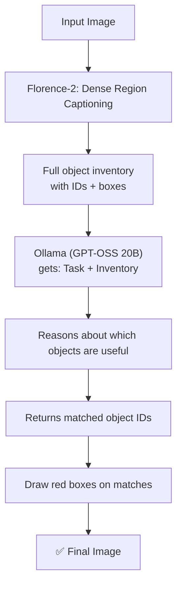
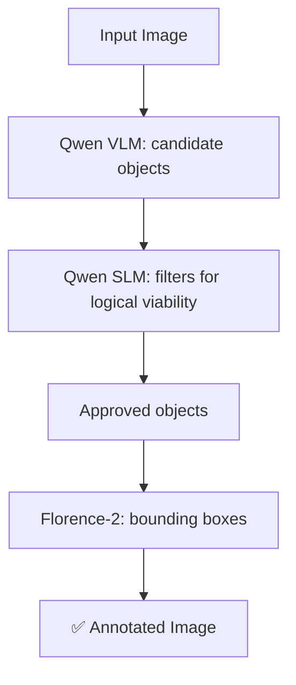

# 📁 Extras

⬅ [Back to Aditya overview](../README.md)

Additional / experimental scripts that don't fit the main KG pattern.

---

## `ollama_florence_pipeline.py` — perception + reasoning split across two models



Florence-2 answers *"what's in the image?"*, Ollama answers *"which of those help with the task?"* — runs fully locally, no API key needed. Intermediate Florence result (green boxes) is also saved.

**Run**
```bash
# make sure the model is running: ollama run gpt-oss:20b
cd Extras
python ollama_florence_pipeline.py
```

---

## `qwen+florence_v3.py` — three-stage cascade, CPU only



VLM = vision, SLM = logic filter, Florence-2 = grounding. Runs entirely on CPU. Every step logged to JSONL. GUI file selector for image input.

---

## `Ansh'sScript.py`

Basic Florence-2 `<OD>` object detection with a GUI file picker — select image → detect → draw boxes → save.

---

## `flatten_dir.sh`

Bash utility (interactive `whiptail` UI) to pull all files out of nested subfolders into one top-level folder and delete the empties.

---

## `test.py`

Quick script to list available Gemini API models (API key placeholder).