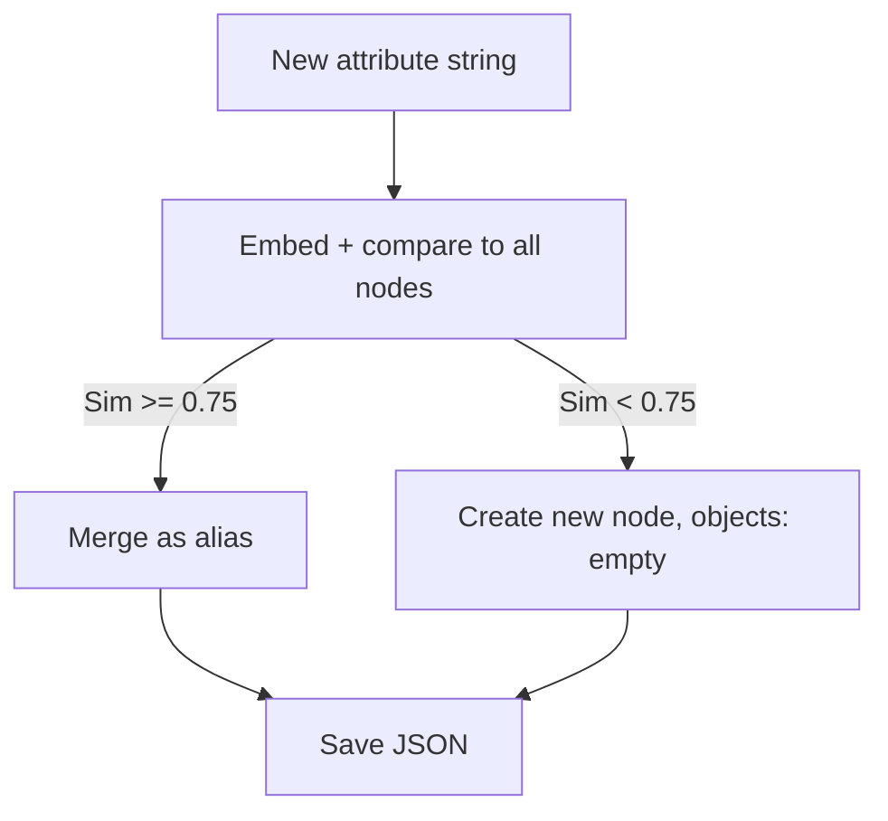
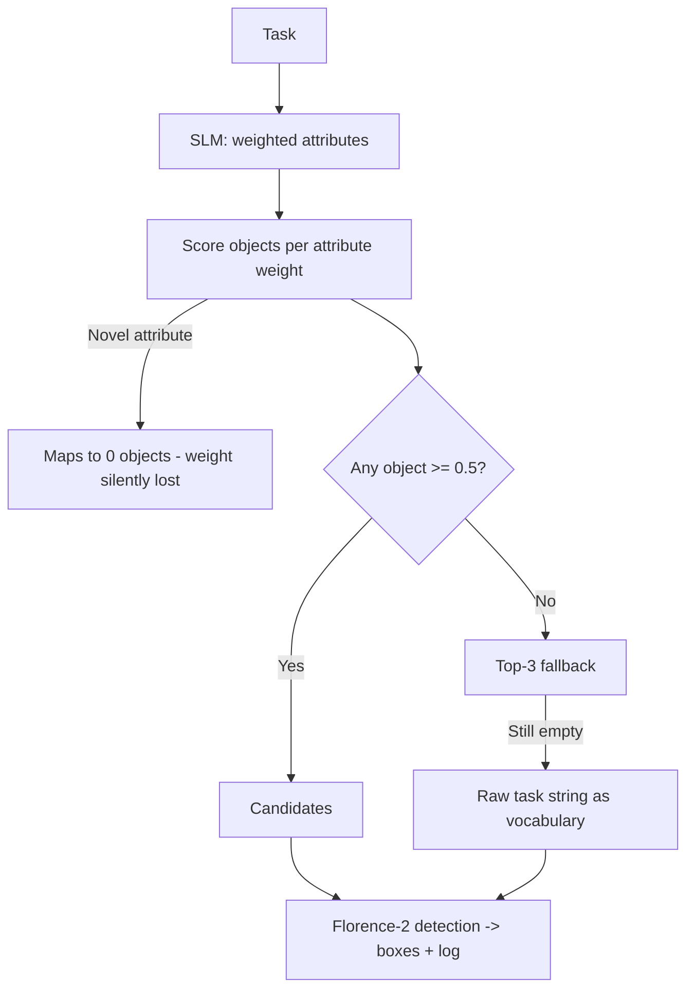

# 📁 graph_approach

Builds an **atomic, vector-based Knowledge Graph** mapping objects to physical properties (`sharp_edge`, `rigid_body`, etc.), then reasons: *what properties does this task need, and which objects have them?* — verified visually with Florence-2.

---

## `atomic_kg_builder.py` — the graph engine

- JSON-backed `VectorAtomicKnowledgeGraph`: `objects` (name → attribute IDs) and `attributes` (node → canonical name, aliases, 384-dim embedding, reverse object list).
- `_find_or_create_attribute_node()` embeds an attribute (`all-MiniLM-L6-v2`) and checks cosine similarity vs all existing nodes: **≥0.75** → merge as alias into that node; below → create a **new node with an empty `objects` list**. It **always returns a valid ID** — there's no "not found" outcome, only "merged into something populated" vs "created something empty."
- `extract_atomic_attributes()` lazily loads `Qwen2.5-3B-Instruct` on CPU to deconstruct an object into traits, parsed via regex from a JSON block. Malformed output → caught, returns `[]`, no crash.
- Only `add_object_with_attributes()` persists (`save()`) — used by `expand_graph.py`, never by the inference agent.



## `vector_atomic_kg.json` — the database

- **393 objects** → **522 attribute nodes**, each with canonical name, aliases, embedding, and linked objects.
- Some "objects" are noisy full captions (e.g. `"woman with tennis racket"`) — a side effect of ingesting raw Florence-2 labels, not curated names.

## `expand_graph.py` — grows the graph from images

- Loads Florence-2 (GPU/CPU), lets user pick folders + a numeric filename range.
- Runs `<DENSE_REGION_CAPTION>` per image → dedupes labels → for each **new** label, calls the SLM for attributes and adds it via `add_object_with_attributes()`.
- Logs a timestamped ingestion summary. Offline/batch only — doesn't run at inference time.
- **Worst case:** a mislabeled/noisy caption becomes a permanent node; an SLM parse failure adds an object with zero attributes, making it permanently unreachable by later queries.

## `quantize_model.py` — model compression utility

- Quantizes `Qwen2.5-7B-Instruct` to 8-bit (`BitsAndBytesConfig`) on CPU, saves sharded to `Models/Qwen-7B-8bit/`.
- **Not currently used anywhere** — both agent scripts still hardcode the 3B model. Standalone/offline prep for a future variant.
- Worst case: insufficient RAM to load the full 7B model → OOM, no partial save.

## `vision_agent_v1.2_.py` — weighted scoring agent (current)

- Prompts for folders + image range, then a free-text task. SLM returns attributes **with priority weights** summing to 1.0 (top 5 kept, via `validate_and_normalize()`).
- **Scoring:** for each attribute, calls `_find_or_create_attribute_node()` — which always succeeds — and adds its weight to every linked object's score. Objects >= `SCORE_THRESHOLD = 0.5` qualify; else fallback to top-3 scoring objects; if still empty, fallback to using the **raw task string** as the detection vocabulary.
- Frees SLM memory before loading Florence-2, runs `<OPEN_VOCABULARY_DETECTION>` over all images, draws boxes, writes `processing_log.txt`.



**Worst case / silent failure — the gap you asked about:**
- If a **high-weight** attribute is novel (no >=0.75 match), it silently contributes to **zero** objects. Remaining weight may be too small to ever reach 0.5 — the threshold becomes mathematically unreachable, forcing the fallback far more than the design implies.
- If **all** attributes are novel, `object_scores` stays empty, top-3 fallback is also empty, and the literal task sentence gets passed to Florence-2 as a detection term — which it can't meaningfully detect, so every image logs FAILED.
- There's **no signal** distinguishing a real match from a freshly-created empty node — only checking `len(objects) == 0` after the call would reveal it.
- This script never calls `save()`, so empty nodes don't pollute the graph file — but the system also never "learns" from a novel task; it re-derives and re-misses the same gap every run.

---

## Files
| File | Role |
|---|---|
| `atomic_kg_builder.py` | Graph class + SLM attribute extraction/merging |
| `vector_atomic_kg.json` | Graph data: 393 objects, 522 attribute nodes |
| `expand_graph.py` | Auto-expands graph from images (offline) |
| `quantize_model.py` | Quantizes Qwen 7B to 8-bit; unused elsewhere currently |
| `vision_agent_v1.2_.py` | Weighted attribute matching + batch detection + logging |

## Hardware
| File | Requirement |
|---|---|
| `atomic_kg_builder.py` / `expand_graph.py` | SLM on CPU (~6.5 GB RAM), Florence-2 on GPU (~0.5 GB) or CPU |
| `quantize_model.py` | Enough RAM to load full 7B model; run once, offline |
| `vision_agent_v1.2_.py` | GPU preferred for Florence-2 + 3B SLM (bfloat16) |

## Run
```bash
cd graph_approach
python vision_agent_v1.2_.py
# select input folders + numeric range, then enter a task e.g. "open a parcel"
```

## Known gaps
1. **Silent attribute loss** — distinguish "merged into populated node" vs "new empty node" so weight can be dropped/renormalized instead of eating into the threshold.
2. **Noisy object vocabulary** — filter Florence-2's raw scene captions before they become permanent nodes.
3. **Dead code** — `quantize_model.py`'s output isn't wired into any agent yet.