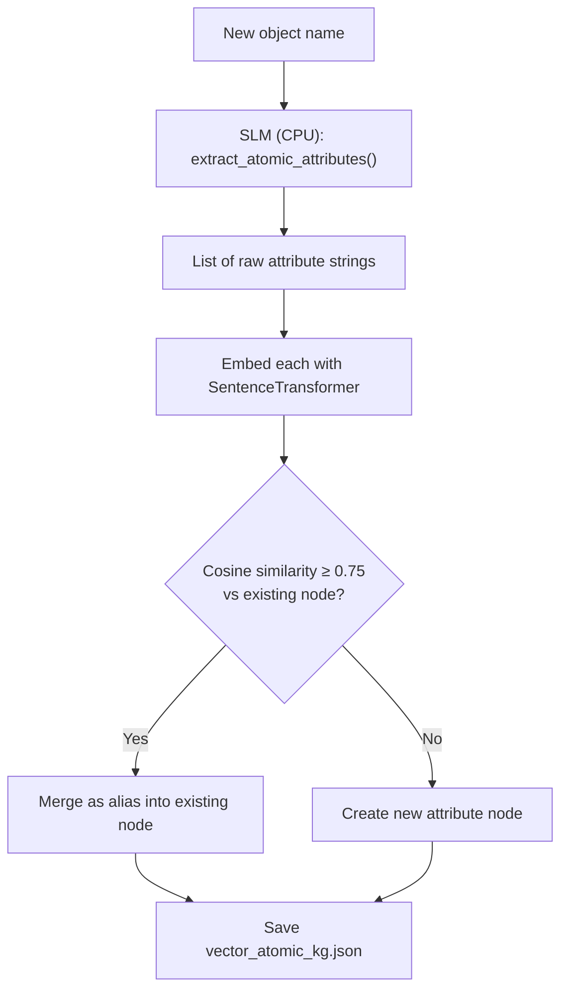
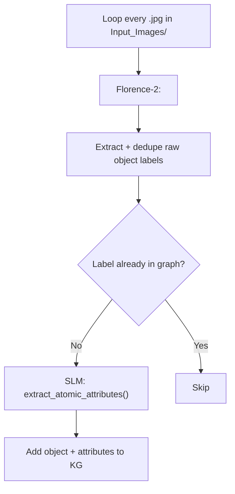
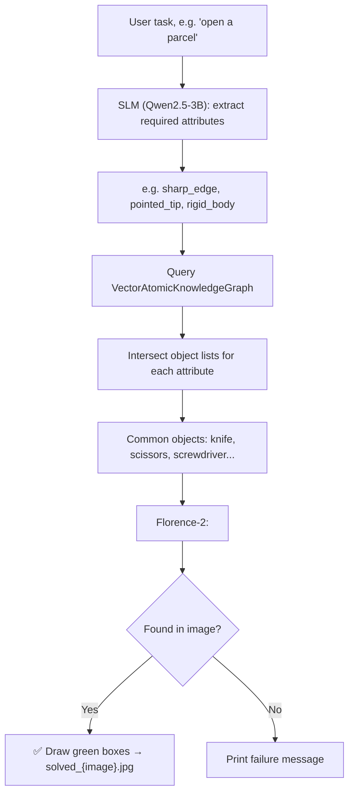
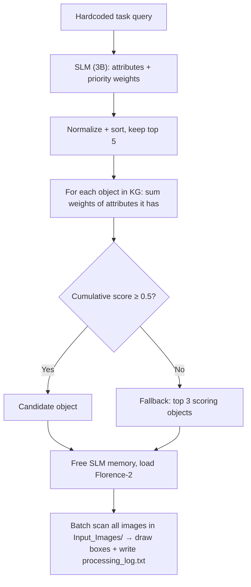

# 📁 graph_approach

⬅ [Back to Aditya overview](../README.md)

**What it does:** The core, current-generation system. Instead of asking a VLM to guess objects directly, it builds an **atomic, vector-based Knowledge Graph** that maps objects to their physical properties (`sharp_edge`, `rigid_body`, `hollow`, etc.), then reasons: *"what physical properties does this task need, and which objects in the graph have them?"* — before verifying visually with Florence-2.

---

## `atomic_kg_builder.py` — the knowledge graph engine itself

Defines the **`VectorAtomicKnowledgeGraph`** class — the "brain" of the whole project.

- Backend is a JSON file (`vector_atomic_kg.json`, saved next to this script) with two dictionaries: `objects` (object → list of attribute IDs) and `attributes` (attribute node → canonical name, aliases, 384-dim embedding, and reverse list of objects that have it).
- **Merge logic:** new attributes are embedded with `SentenceTransformer("all-MiniLM-L6-v2")`. Cosine similarity is checked against every existing attribute node — **≥ 0.75** merges into that node (as an alias); below that, a brand-new node is created. This prevents duplicate nodes like `sharp_edge` vs `sharp-edged` vs `has sharp edge`.
- **SLM-powered ingestion:** `extract_atomic_attributes()` lazily loads `Qwen/Qwen2.5-3B-Instruct` on **CPU** (`device_map="cpu"`, `bfloat16`) and asks it to break an object name (e.g. `"Kitchen Knife"`) into atomic traits (e.g. `["sharp_edge", "rigid_body", "metallic"]`), parsed out of the model's output via regex.
- Has a `__main__` runner that seeds the graph with 12 common objects (thermos, colander, plunger, etc.) to demonstrate ingestion and confirm the merge logic works on synonymous phrasing.



## `vector_atomic_kg.json` — the persistent graph database

- **107 objects** (e.g. `kitchen_knife`, `scissors`, `sword`) mapped to **220 unique attribute nodes**.
- Each attribute node stores its `canonical_name`, `aliases`, its 384-float embedding vector (matching `all-MiniLM-L6-v2`'s output dimension), and every object that has it — enabling reasoning like *"find all objects with both `sharp_edge` and `rigid_body`."*

## `expand_graph.py` — automatic graph growth from images

- Loads **Florence-2 permanently on GPU** (small, ~0.5 GB), using `float16` on CUDA / `float32` on CPU.
- Loops over **every `.jpg` file** found in the central `Input_Images/` folder (dynamically discovered, not a hardcoded range).
- Runs Florence's `<DENSE_REGION_CAPTION>` to get raw object labels present in each image, deduplicates them per image, and for every **new** label (not already in `kg.objects`) calls `extract_atomic_attributes()` (SLM) and ingests it via `kg.add_object_with_attributes()`.
- Writes a timestamped log folder (`expand_graph_YYYYMMDD_HHMMSS/`) under the team output directory.
- This is an **offline/batch tool** — it doesn't run during task inference, it slowly builds up the graph's vocabulary over time from real images.



## `quantize_model.py` — model compression utility

- Downloads `Qwen/Qwen2.5-7B-Instruct` and quantizes it to **8-bit** using `BitsAndBytesConfig(load_in_8bit=True)`, loaded on `device_map="cpu"`.
- Saves the compressed model locally to `Models/Qwen-7B-8bit/` (at the shared project root) with `max_shard_size="1GB"` (splits it into manageable chunks).
- Sets `HF_HOME` to the project's `HuggingFaceModels/` cache directory so the ~14 GB of original weights land in a predictable, shared location.
- **Why it exists:** the 7B model (used by `vision_agent_v1.1.py`) would strain a small GPU / require huge RAM at full precision — this pre-quantization step makes it usable.

## `vision_agent.py` — the base reasoning agent (single image)

The clean, foundational implementation of Task → Attributes → Graph → Florence.


- Prompts the user for both an image filename (relative to `Input_Images/`) and a task string.
- SLM (`Qwen2.5-3B-Instruct`, GPU if available) outputs a flat list of snake_case attributes.
- Graph lookup is a plain **set intersection**: an object must have *every* required attribute to qualify.
- Output: `solved_<image_name>.jpg` with green bounding boxes, saved under a task-named subfolder.

## `vision_agent_v1.1.py` — batch mode + bigger SLM, all-CPU

- Upgrades to `Qwen/Qwen2.5-7B-Instruct`, loaded **8-bit on CPU** (`DEVICE = "cpu"` is hardcoded) — a fully CPU-based reasoning pipeline.
- Still takes a single task query via user input, but instead of one image it batch-scans a **hardcoded range**: `for i in range(1, 201)` (images `1.jpg`–`200.jpg`) from `Input_Images/`.
- SLM attribute extraction and the graph query run **once**, then are reused across all 200 images — much more efficient than recomputing per image.
- Same intersection-based (AND) attribute matching as `vision_agent.py`.
- Saves annotated results to a task-named subfolder under `Output_Images/Aditya/Graph_Approach/`, printing `[+] Detected` / `[-] No target objects found` per image and a final summary count.

## `vision_agent_v1.2_.py` — weighted / scored reasoning + batch, with logging

The most mathematically advanced version — moves from hard set-intersection to a **soft, weighted scoring system**, and folds in the batch-processing pattern from v1.1.

- SLM (`Qwen2.5-3B-Instruct`, GPU if available, `bfloat16`) outputs attributes **with priority weights** summing to 1.0, e.g.:
  ```json
  [{"attribute": "sharp_edge", "priority": 0.7}, {"attribute": "rigid_body", "priority": 0.2}, {"attribute": "pointed_tip", "priority": 0.1}]
  ```
  A `validate_and_normalize()` helper re-normalizes weights, sorts by priority, and caps the list at the top 5 attributes.
- Graph lookup accumulates a **score per object**: an object gains an attribute's weight if it possesses that attribute. Objects reaching **`SCORE_THRESHOLD = 0.5`** (50% cumulative weight) qualify as candidates; if none clear the bar, a fallback grabs the **top 3 highest-scoring objects** instead.
- `TASK_QUERY` is hardcoded (`"open a parcel"`) for batch testing rather than taken as input.
- Instead of a fixed image count, `get_image_files()` scans `Input_Images/` for every `.jpg/.jpeg/.png/.bmp`, sorts them numerically by the digits in the filename, and processes all of them with a **`tqdm` progress bar**.
- Writes a detailed `processing_log.txt` in the task's output folder (task, extracted attributes, selected objects, plus per-image SUCCESS/FAILED status).
- Explicitly `del`s the SLM and clears the CUDA cache **before** loading Florence-2, to keep GPU memory free during the vision stage — good practice for constrained GPUs.



---

## Files
| File | Role |
|---|---|
| `atomic_kg_builder.py` | Defines `VectorAtomicKnowledgeGraph`; SLM-based attribute extraction & merging |
| `vector_atomic_kg.json` | The graph data: 107 objects, 220 attribute nodes |
| `expand_graph.py` | Auto-expands the graph from every image in `Input_Images/` (Florence + SLM) |
| `quantize_model.py` | Pre-quantizes Qwen 7B to 8-bit for cheaper loading |
| `vision_agent.py` | Base single-image reasoning agent (interactive, AND-matching) |
| `vision_agent_v1.1.py` | Batch (200 images), 7B SLM on CPU, 8-bit, AND-matching |
| `vision_agent_v1.2_.py` | Weighted/scored attribute matching, 3B SLM on GPU, full-folder batch + logging |

## Hardware Requirements
| File | Requirement |
|---|---|
| `atomic_kg_builder.py` / `expand_graph.py` | SLM on CPU (~6.5 GB RAM), Florence-2 on GPU (~0.5 GB) |
| `quantize_model.py` | Needs enough system RAM to load the 7B model for quantization; run once, offline |
| `vision_agent.py` | GPU for Florence + SLM (3B, bfloat16), CPU fallback supported |
| `vision_agent_v1.1.py` | Fully CPU — 7B SLM in 8-bit needs substantial system RAM (16 GB+ recommended) |
| `vision_agent_v1.2_.py` | GPU for Florence + SLM (3B, bfloat16); frees SLM memory before loading Florence-2 |

## Run
```bash
cd graph_approach
python vision_agent.py
# enter an image filename (e.g. 1.jpg) and a task (e.g. "open a parcel")
```