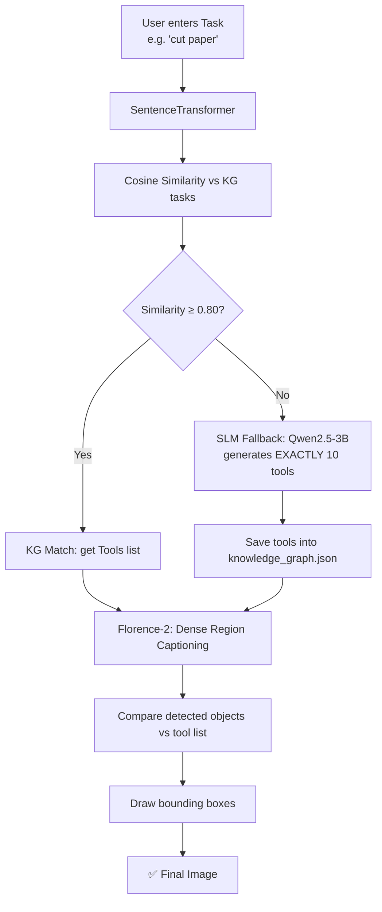

# 📁 Hash_Map

⬅ [Back to Aditya overview](../README.md)

**What it does:** A simpler, flat version of the KG idea — skips the action/attribute layers and maps `Task → Tools` directly.

## Flow



## Why it's different from Hierarchical_KG

```
Hierarchical_KG:  Task → Action → Attribute → Tool   (more reasoning)
Hash_Map:         Task → Tool                        (faster, simpler)
```

## Details
- Similarity **threshold 0.80**
- SLM always generates **exactly 10 tools**, explicitly told not to return body parts or living beings
- New tools auto-saved to `knowledge_graph.json`

## Files
| File | Role |
|---|---|
| `pipeline_with_kg.py` | Main pipeline |
| `kg_manager.py` | Embedding + similarity search |
| `llm_fallback.py` | Generates 10 tools |
| `knowledge_graph.json` | Stored task → tool mappings (90+) |

## Output
```
kg_output_{image}.jpg
```

## Run
```bash
cd Hash_Map
python pipeline_with_kg.py
# try: "cut paper"
```