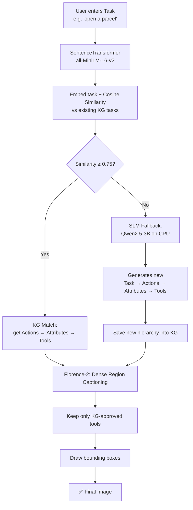

# 📁 Hierarchical_KG

⬅ [Back to Aditya overview](../README.md)

**What it does:** Looks up a **3-hop knowledge graph** — `Task → Actions → Attributes → Tools` — to decide which tools are relevant, then finds them in the image.

## Flow



## Worked example

```
"open a parcel"  →  "cut tape"  →  "sharp edge"  →  scissors / knife / box cutter
   (Task)           (Action)       (Attribute)              (Tools)
```

## Details
- Semantic (not exact-text) matching via cosine similarity, **threshold 0.75**
- SLM fallback (**Qwen2.5-3B**, CPU, ~6.5 GB RAM) writes new knowledge back into the graph — it grows over time
- Florence-2 uses `<DENSE_REGION_CAPTION>` to find everything in the image, then filters to KG-approved tools only

## Files
| File | Role |
|---|---|
| `pipeline_with_kg.py` | Main pipeline |
| `kg_manager.py` | Embeddings, similarity, graph traversal |
| `llm_fallback.py` | Generates new task hierarchy |
| `hierarchical_kg.json` | Stored knowledge (90+ tasks) |

## Output
```
hierarchical_kg_{image}.jpg
```

## Run
```bash
cd Hierarchical_KG
python pipeline_with_kg.py
# try: "open a parcel"
```