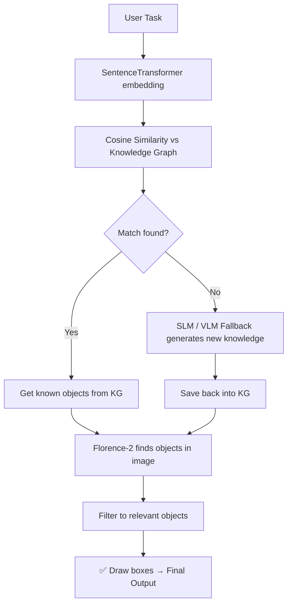

# 🧠 Aditya's Vision-Language & Knowledge Graph Pipelines

Different approaches for finding **task-relevant objects/tools in an image**, using VLMs, SLMs, Knowledge Graphs, Sentence Transformers, and Florence-2.

> **Core question:** *Given a task and an image, which objects in the image can be used to perform that task?*

Each subfolder has its **own README** with full details — this page is just the map. Click into a folder to read how that pipeline works.

---

## 📑 Pipelines

| Folder | Approach | README |
|---|---|---|
| `Scene_graph/` | Full scene understanding (entities + relationships), no task input | [Scene_graph/README.md](./Scene_graph/README.md) |
| `Hierarchical_KG/` | `Task → Action → Attribute → Tool` | [Hierarchical_KG/README.md](./Hierarchical_KG/README.md) |
| `Hash_Map/` | `Task → Tool` (flat, fast) | [Hash_Map/README.md](./Hash_Map/README.md) |
| `Attribute_KG/` | `Physical Attribute → Tool` (generalizable, VLM+SLM+Florence) | [Attribute_KG/README.md](./Attribute_KG/README.md) |
| `Extras/` | Experimental pipelines + utility scripts | [Extras/README.md](./Extras/README.md) |

---

## 🔄 Common Pattern Across the KG Pipelines



What changes between pipelines is **what key is searched in the graph** — see each folder's README for its exact flow, thresholds, and files.

---

## 🤖 Models Used

| Model | Purpose | Memory |
|---|---|---|
| Qwen2.5-VL-3B | Image understanding / object discovery | ~2.5 GB VRAM (4-bit) |
| Qwen2.5-3B | Task reasoning, tool/attribute generation | ~6.5 GB RAM (CPU) or ~2.5 GB VRAM (4-bit) |
| Florence-2 | Object detection & bounding-box grounding | ~1.5 GB VRAM |
| all-MiniLM-L6-v2 | Text → embedding for semantic search | ~400 MB RAM |
| GPT-OSS 20B (Ollama) | Local reasoning in the Ollama pipeline | Runs via Ollama |

---

## 📤 Outputs

All results are saved under:
```
Output_Images/Aditya/{Module_Name}/{timestamp_or_task_name}/
```

## 🚀 Quick Start

Place input images in `Project_Root/Input_Images/`, then `cd` into the pipeline folder you want and run its script — see that folder's README for the exact command and a sample task to try.

---

**Author:** Aditya · RM Team, Project_Root