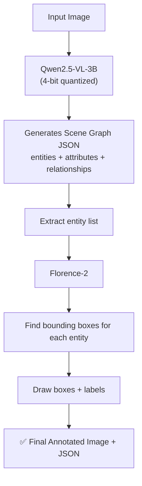
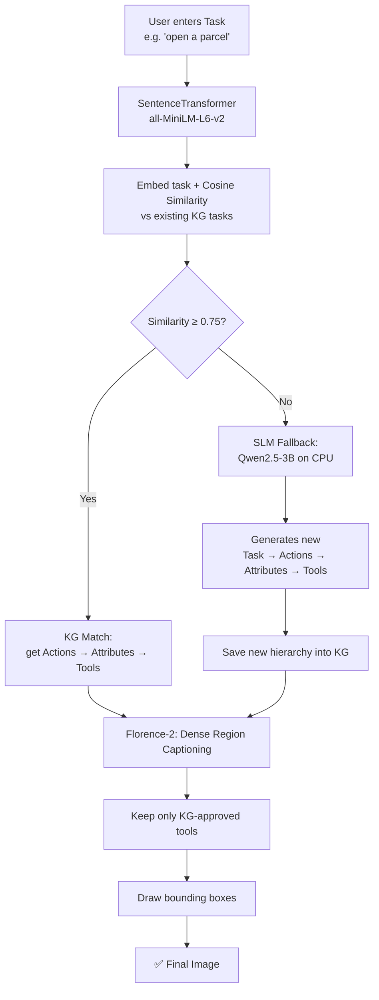
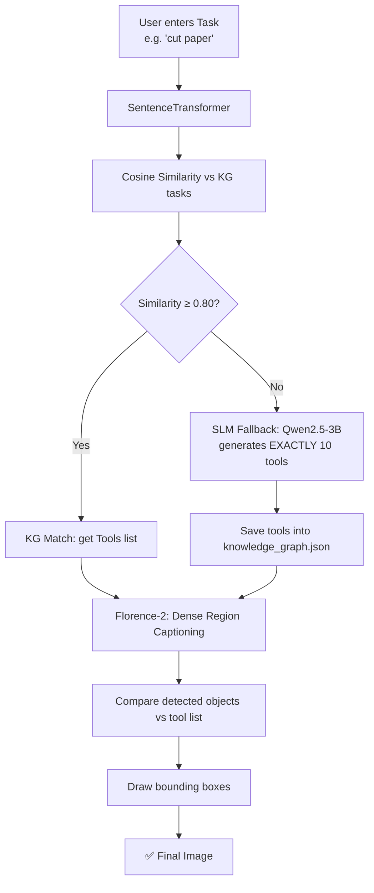
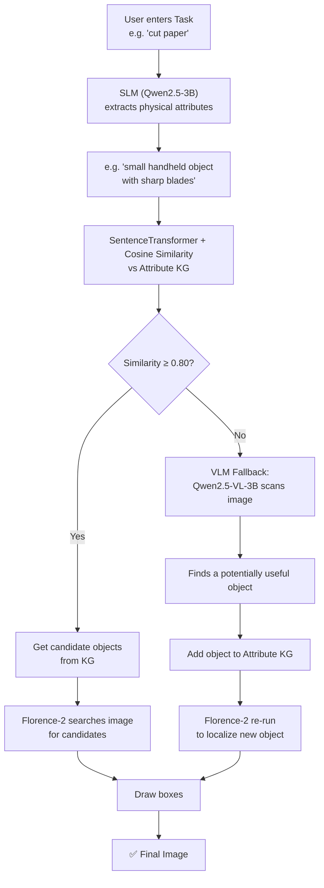
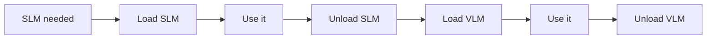
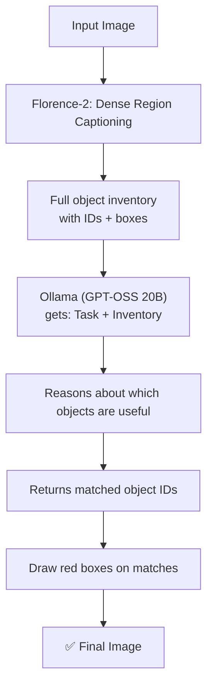
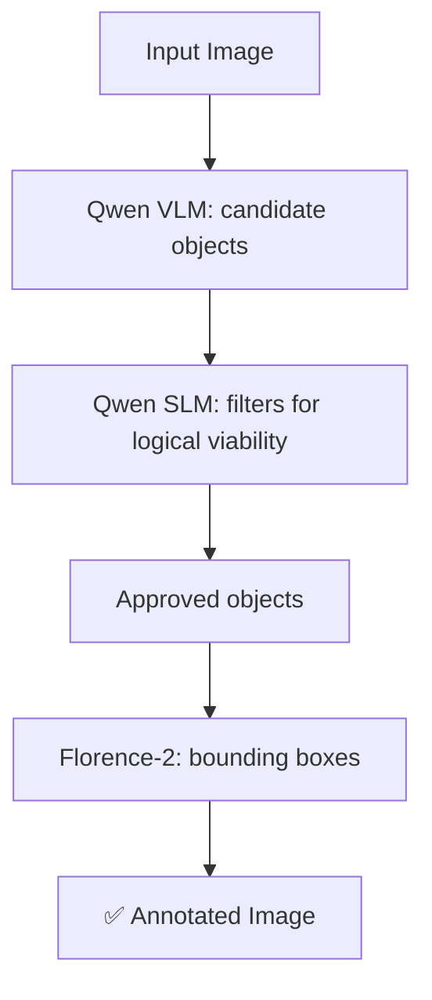
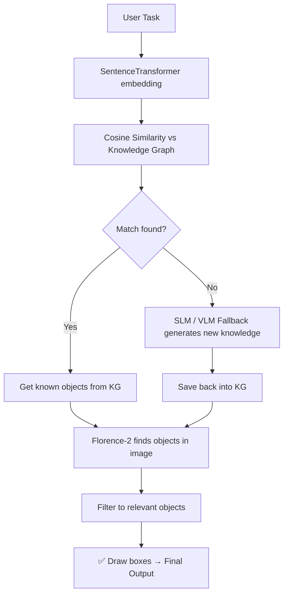

# 🧠 Aditya's Vision-Language & Knowledge Graph Pipelines

Different approaches for finding **task-relevant objects/tools in an image**, using VLMs, SLMs, Knowledge Graphs, Sentence Transformers, and Florence-2.

> **Core question:** *Given a task and an image, which objects in the image can be used to perform that task?*

Each pipeline answers this differently — the sections below show **what each one does** and **how it flows**, end to end.

---

## 📑 Contents

| Folder | Approach |
|---|---|
| [Scene_graph](#-scene_graph) | Full scene understanding (entities + relationships) |
| [Hierarchical_KG](#-hierarchical_kg) | `Task → Action → Attribute → Tool` |
| [Hash_Map](#-hash_map) | `Task → Tool` (flat, fast) |
| [Attribute_KG](#-attribute_kg) | `Physical Attribute → Tool` (generalizable) |
| [Extras](#-extras) | Experimental / utility scripts |

---

## 📁 Scene_graph

**What it does:** Understands the *entire* image — objects, their attributes, and how they relate to each other. No task input needed.



**Details**
- **Qwen2.5-VL-3B-Instruct** does the image understanding, loaded in **4-bit** (~2.5 GB VRAM)
- JSON is extracted robustly even if the model's output isn't perfectly formatted
- **Florence-2** grounds each entity spatially (finds *where* it is)
- Outputs saved in timestamped folders

**Output:** `scene_graph_{image}.json` · `annotated_{image}.jpg`

---

## 📁 Hierarchical_KG

**What it does:** Looks up a **3-hop knowledge graph** — `Task → Actions → Attributes → Tools` — to decide which tools are relevant, then finds them in the image.



**Worked example**

```
"open a parcel"  →  "cut tape"  →  "sharp edge"  →  scissors / knife / box cutter
   (Task)           (Action)       (Attribute)              (Tools)
```

**Details**
- Semantic (not exact-text) matching via cosine similarity, **threshold 0.75**
- SLM fallback (**Qwen2.5-3B**, CPU, ~6.5 GB RAM) writes new knowledge back into the graph — it grows over time
- Florence-2 uses `<DENSE_REGION_CAPTION>` to find everything in the image, then filters to KG-approved tools only

**Files**
| File | Role |
|---|---|
| `pipeline_with_kg.py` | Main pipeline |
| `kg_manager.py` | Embeddings, similarity, graph traversal |
| `llm_fallback.py` | Generates new task hierarchy |
| `hierarchical_kg.json` | Stored knowledge (90+ tasks) |

---

## 📁 Hash_Map

**What it does:** A simpler, flat version — skips the action/attribute layers and maps `Task → Tools` directly.



**Why it's different from Hierarchical_KG**

```
Hierarchical_KG:  Task → Action → Attribute → Tool   (more reasoning)
Hash_Map:         Task → Tool                        (faster, simpler)
```

**Details**
- Similarity **threshold 0.80**
- SLM always generates **exactly 10 tools**, explicitly told not to return body parts or living beings
- New tools auto-saved to `knowledge_graph.json`

**Files**
| File | Role |
|---|---|
| `pipeline_with_kg.py` | Main pipeline |
| `kg_manager.py` | Embedding + similarity search |
| `llm_fallback.py` | Generates 10 tools |
| `knowledge_graph.json` | Stored task → tool mappings (90+) |

---

## 📁 Attribute_KG

**What it does:** Instead of keying the graph on the *task name*, it keys on the **physical attributes** the task needs — making the KG reusable across many similar tasks.



**Worked example**

```
Task: "cut paper"
   ↓ SLM extracts attribute
"small handheld object with sharp blades"
   ↓ matched in Attribute KG
scissors / knife / box cutter
   ↓ Florence-2 locates in image
```

If no attribute matches, the pipeline **doesn't just give up** — the VLM looks at the image directly, finds something useful, and teaches the KG a new attribute → object mapping for next time.

**VRAM management** — three models (SLM, VLM, Florence-2) can't all fit comfortably, so:


Only **one Qwen model** (SLM *or* VLM) is ever in VRAM at once; **Florence-2 stays loaded permanently**. Runs within ~6 GB VRAM.

**Files**
| File | Role |
|---|---|
| `kg_vlm_slm_florence_v1.py` | Main pipeline + VRAM swapping |
| `kg_manager.py` | Attribute embedding + matching |
| `attribute_knowledge_graph.json` | Attribute → tool mappings |

---

## 📁 Extras

Additional / experimental scripts that don't fit the main KG pattern.

### `ollama_florence_pipeline.py` — perception + reasoning split across two models


Florence-2 answers *"what's in the image?"*, Ollama answers *"which of those help with the task?"* — runs fully locally, no API key needed. Intermediate Florence result is saved too.

### `qwen+florence_v3.py` — three-stage cascade, CPU only


VLM = vision, SLM = logic filter, Florence-2 = grounding. Every step logged to JSONL.

### `Ansh'sScript.py`
Basic Florence-2 `<OD>` object detection with a GUI file picker — select image → detect → draw boxes → save.

### `flatten_dir.sh`
Bash utility (interactive `whiptail` UI) to pull all files out of nested subfolders into one top-level folder and delete the empties.

### `test.py`
Quick script to list available Gemini API models.

---

## 🔄 Common Pattern Across the KG Pipelines



What changes between pipelines is **what key is searched in the graph**:

| Pipeline | KG Key → Value |
|---|---|
| Hierarchical_KG | `Task → Action → Attribute → Tool` |
| Hash_Map | `Task → Tool` |
| Attribute_KG | `Physical Attribute → Tool` |

---

## 🤖 Models Used

| Model | Purpose | Memory |
|---|---|---|
| Qwen2.5-VL-3B | Image understanding / object discovery | ~2.5 GB VRAM (4-bit) |
| Qwen2.5-3B | Task reasoning, tool/attribute generation | ~6.5 GB RAM (CPU) or ~2.5 GB VRAM (4-bit) |
| Florence-2 | Object detection & bounding-box grounding | ~1.5 GB VRAM |
| all-MiniLM-L6-v2 | Text → embedding for semantic search | ~400 MB RAM |
| GPT-OSS 20B (Ollama) | Local reasoning in the Ollama pipeline | Runs via Ollama |

---

## 📤 Outputs

All results are saved under:
```
Output_Images/Aditya/{Module_Name}/{timestamp_or_task_name}/
```
Depending on the pipeline: an annotated image, plus JSON/JSONL with intermediate or final data.

---

## 🚀 Quick Start

Place input images in `Project_Root/Input_Images/`, then:

```bash
# Scene Graph
cd Scene_graph && python scene_graph_vlm_pipeline.py

# Hierarchical KG
cd Hierarchical_KG && python pipeline_with_kg.py      # try: "open a parcel"

# Hash Map KG
cd Hash_Map && python pipeline_with_kg.py              # try: "cut paper"

# Attribute KG
cd Attribute_KG && python kg_vlm_slm_florence_v1.py     # try: "open the parcel"

# Ollama pipeline (requires `ollama run gpt-oss:20b` running)
cd Extras && python ollama_florence_pipeline.py
```

---

## 💡 Summary

```
Scene Graph        → Understand everything in the image
Hierarchical KG     → Task → Action → Attribute → Tool → Image
Hash Map            → Task → Tool → Image
Attribute KG         → Task → Physical Attribute → Tool → Image
Ollama + Florence   → Image Inventory → LLM Reasoning → Relevant Objects
Qwen + Florence     → VLM Candidates → SLM Filtering → Object Grounding
```

---

**Author:** Aditya · RM Team, Project_Root