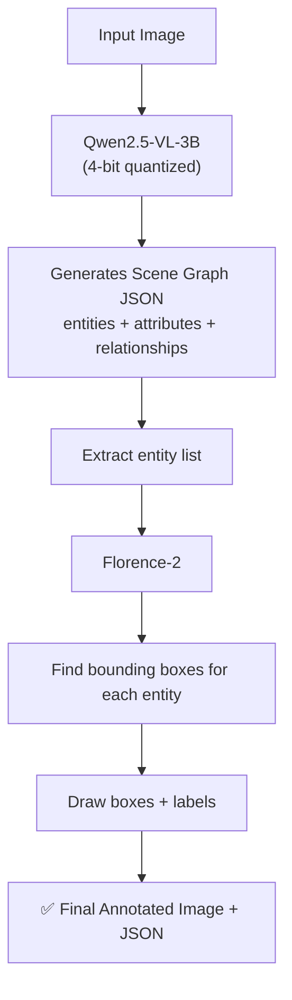

# 📁 Scene_graph

⬅ [Back to Aditya overview](../README.md)

**What it does:** Understands the *entire* image — objects, their attributes, and how they relate to each other. No task input needed.

## Flow



## Details
- **Qwen2.5-VL-3B-Instruct** does the image understanding, loaded in **4-bit** (~2.5 GB VRAM)
- JSON is extracted robustly even if the model's output isn't perfectly formatted
- **Florence-2** grounds each entity spatially (finds *where* it is)
- Outputs saved in timestamped folders

## Output
```
scene_graph_{image}.json
annotated_{image}.jpg
```

## Files
| File | Role |
|---|---|
| `scene_graph_vlm_pipeline.py` | Main pipeline |

## Run
```bash
cd Scene_graph
python scene_graph_vlm_pipeline.py
```