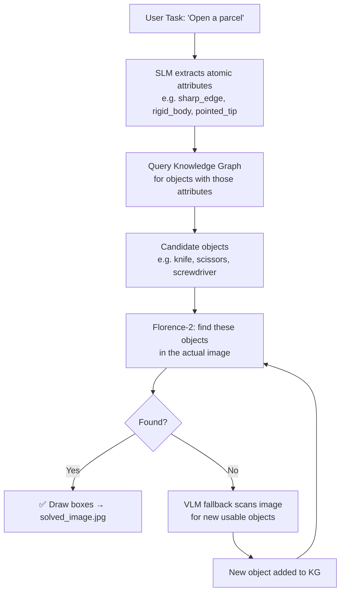

# 🧠 Anshdeep_Singh — Object Grounding & Knowledge Graph Suite

A suite of pipelines for **Visual Grounding + Physical Tool Affordance Reasoning**.

> **Core question:** *Given a physical task (e.g. "open a parcel") and an image, which objects in the image are physically capable of doing it — based on their atomic properties (sharp edge, rigid body, hollow, etc.)?*

Each subfolder has its own README with full details of every file inside it.

---

## 📑 Folders

| Folder | Focus | README |
|---|---|---|
| `basic_pipeline/` | VLM (Qwen) → Florence-2 direct reasoning chain, no Knowledge Graph | [basic_pipeline/README.md](./basic_pipeline/README.md) |
| `graph_approach/` | The atomic Vector Knowledge Graph + reasoning agents (current, active work) | [graph_approach/README.md](./graph_approach/README.md) |
| `graph_approach/old/` | Earlier KG manager + VLM-only pipelines (superseded, kept for reference) | [graph_approach/old/README.md](./graph_approach/old/README.md) |
| `Tools/` | Standalone utility scripts (unrelated to the main pipeline) | [Tools/README.md](./Tools/README.md) |

---

## 🔩 Core Models Used Across the Project

| Model | Role | Typical Load |
|---|---|---|
| `Qwen/Qwen2.5-VL-3B-Instruct` | Vision-Language Model — looks at the image, reasons about candidate objects | 4-bit quantized, GPU |
| `Qwen/Qwen2.5-3B-Instruct` | Small Language Model — extracts atomic physical attributes needed for a task, or filters candidates | CPU (bfloat16) or 4-bit GPU |
| `Qwen/Qwen2.5-7B-Instruct` | Larger SLM — same role, higher quality, used in later `vision_agent` versions | 8-bit CPU / 4-bit GPU |
| `florence-community/Florence-2-base-ft` | Object detection & grounding (bounding boxes) | ~0.5 GB, stays loaded on GPU |
| `all-MiniLM-L6-v2` (SentenceTransformer) | Embeds attributes/tasks into 384-dim vectors for cosine-similarity search | ~400 MB RAM |

---

## 🔄 The General Idea (applies mainly to `graph_approach/`)

`basic_pipeline/` skips the Knowledge Graph entirely and goes straight from VLM reasoning to Florence-2 grounding — see its own README for that flow.

---

## 💾 Hardware & Storage Notes (project-wide)

- Several scripts set `os.environ["HF_HOME"]` to an **external drive** (`/media/anshdeep-singh/Aditya/HuggingFaceModels`) so downloaded model weights don't fill the local system disk.
- Most pipelines are built around a **~6 GB VRAM constraint** — heavy use of `BitsAndBytesConfig` for **4-bit (NF4)** or **8-bit** quantization.
- Where GPU space is tight, the **SLM is deliberately pushed to CPU/system RAM** (`device_map="cpu"`, `torch.bfloat16`) so the GPU is reserved for the VLM and Florence-2. This needs **16 GB+ system RAM** to hold a 3B–7B model comfortably.
- Florence-2 is small enough (~0.5 GB) that it's kept permanently resident on GPU in almost every pipeline.

See each subfolder's README for the exact per-file breakdown, hardware requirements, and how to run each script.

---

**Author:** Anshdeep Singh · RM Team, Project_Root