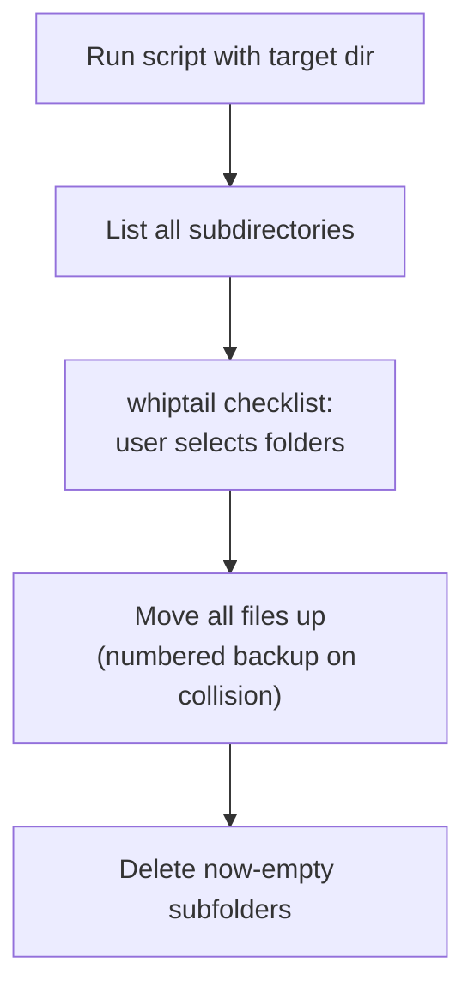
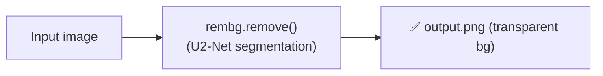

# 📁 Tools

⬅ [Back to Anshdeep_Singh overview](../README.md)

Standalone utility scripts — not part of the main detection/reasoning pipeline, but used to prep data or manage files.

---

## `flatten_dir.sh`

Bash script that **recursively flattens nested folders** into one top-level directory.

- Validates a target directory was passed as an argument (`$1`); checks `whiptail` is installed (prints an `apt-get install` hint if not).
- Uses `find` to list every subdirectory, no matter how deeply nested.
- Builds an **interactive checklist UI** with `whiptail` so the user can pick which folders to flatten.
- For each selected folder: `find "$dir" -type f -exec mv --backup=numbered -t . {} +` — moves every file up to the top level. `--backup=numbered` prevents overwrites by renaming collisions (e.g. `file.txt.~1~`).
- Finishes with a bottom-up `find -delete` to remove the now-empty nested folders safely.



## `rem_bg.py`

A 6-line utility using the **`rembg`** library to strip the background out of an image.

- Loads `pizza.avif`, passes it through `remove()` (a U²-Net-based segmentation model under the hood), and saves the transparent result as `output.png`.
- Used for cleaning up sample images (e.g. `pizza.avif`, `HTTYD.avif` seen in this folder) — isolating the subject before it's used elsewhere in the dataset or for visual debugging.
- Depends on `rembg`, which itself pulls in `onnxruntime` and (indirectly) `torch`.



---

## Files
| File | Role |
|---|---|
| `flatten_dir.sh` | Recursively flattens nested folders into one, with interactive selection |
| `rem_bg.py` | Removes image background via `rembg` |
| `HTTYD.avif`, `pizza.avif` | Sample/test images |
| `output.png` | Sample background-removed output |

## Requirements
- `flatten_dir.sh` needs `whiptail` (usually in the `whiptail`/`newt` package on Debian/Ubuntu).
- `rem_bg.py` needs `rembg` and `Pillow` installed (`pip install rembg pillow`).

## Run
```bash
# Flatten a folder
bash flatten_dir.sh /path/to/target/folder

# Remove background from an image
python rem_bg.py
```