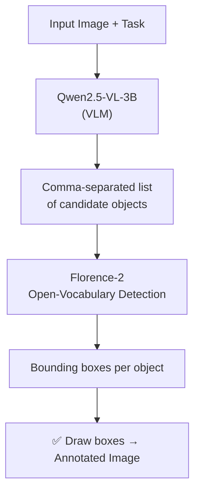

# 📁 basic_pipeline

⬅ [Back to Anshdeep_Singh overview](../README.md)

**What it does:** The "no knowledge graph" approach — chains a **Vision-Language Model (VLM)** directly to **Florence-2** for object grounding. This is the earlier, simpler design philosophy compared to `graph_approach/`. Four versions exist, each adding a layer of robustness or optimization.

## Shared Flow (all versions)



---

## `qwen+florence.py` — the original, interactive version

- Opens a **Tkinter GUI file dialog** so the user manually picks an image each run.
- Prompts Qwen VLM with a strict instruction: return **only** a comma-separated list of short noun phrases (e.g. `"knife, red scissors"`) — no conversational text, so parsing is trivial.
- Splits the string on commas, strips whitespace, and feeds each object name into Florence-2's `<OPEN_VOCABULARY_DETECTION>` task.
- Draws **red boxes** with `PIL.ImageDraw` and saves to `Annotated_Images/`.
- Runs in a `while True` loop — prompts for a new image/query every iteration.

## `qwen+florence_v2.py` — batch mode + dataset logging

- Removes the GUI; replaced with a **hardcoded numeric range** (e.g. `for i in range(466, 467)`) to loop over `1.jpg, 2.jpg, ...` unattended.
- Deduplicates Qwen's object list (`set()` → `list()`) so Florence doesn't detect the same object twice.
- **New:** writes a `qwen+florence_v2.jsonl` log — one JSON line per image containing the filename, prompt used, raw Qwen object list, and full Florence detections (label + bounding box). This becomes a structured dataset for later evaluation/training.

## `qwen+florence_v3.py` — adds quantization + a 3rd model (SLM filter)

- Loads the VLM with `BitsAndBytesConfig(load_in_4bit=True, bnb_4bit_compute_dtype=torch.float16)` — cuts VRAM from ~6 GB to ~2 GB.
- Introduces `Qwen/Qwen2.5-3B-Instruct` (also 4-bit) as a **logical filter**: `filter_objects_with_slm()` takes the VLM's raw (possibly hallucinated) object list and asks the SLM to keep only objects that are **practically and safely viable** for the specific task. If the SLM says `"NONE"`, the pipeline stops there.
- Net effect: VLM proposes → SLM filters → Florence grounds. Higher precision than v2.

## `qwen+florence_v3.1.py` — hardware-optimized 3-model split

- Explicitly separates devices: `GPU_DEVICE` (CUDA) for the **VLM + Florence-2**, `CPU_DEVICE` for the **SLM** (`device_map="cpu"`, `torch.bfloat16`).
- Rationale: the SLM is text-only and doesn't need a GPU — keeping it on CPU frees VRAM for the two vision models, letting the whole pipeline run on **4–6 GB VRAM**.
- Caps VLM image resolution (`min_pixels=256*28*28`, `max_pixels=768*28*28`) to avoid OOM errors on large images.
- Wraps inference in `torch.no_grad()` throughout to save memory and speed things up.

---

## Files
| File | Role |
|---|---|
| `qwen+florence.py` | Original interactive (GUI) 2-stage pipeline |
| `qwen+florence_v2.py` | Batch mode + JSONL dataset logging |
| `qwen+florence_v3.py` | Adds 4-bit quantization + SLM logical filter (3-model) |
| `qwen+florence_v3.1.py` | Hardware-split version: SLM on CPU, VLM+Florence on GPU |

## Hardware Requirements
| Version | GPU VRAM | Notes |
|---|---|---|
| v1 (`qwen+florence.py`) | ~8 GB+ | Full-precision VLM + Florence together |
| v2 | ~8 GB+ | Same models, batch loop instead of GUI |
| v3 | ~3–4 GB | 4-bit VLM + 4-bit SLM + Florence |
| v3.1 | ~4–6 GB (GPU) + 16 GB RAM (CPU for SLM) | Most memory-efficient; SLM offloaded to system RAM |

## Run
```bash
cd basic_pipeline
python "qwen+florence_v3.1.py"   # most optimized version
```