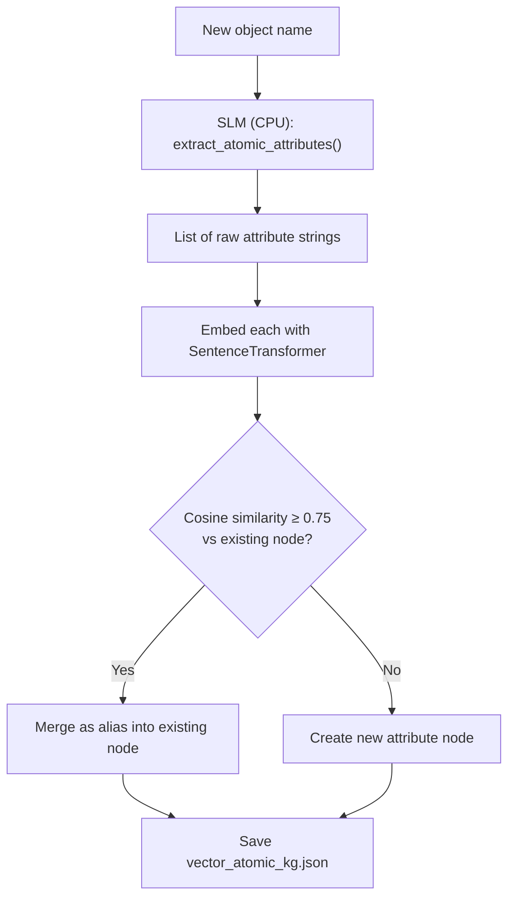
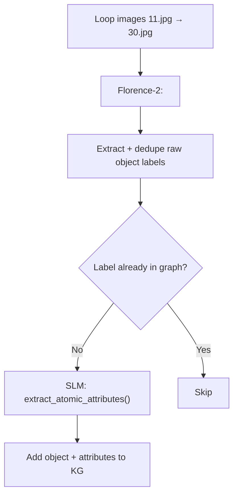
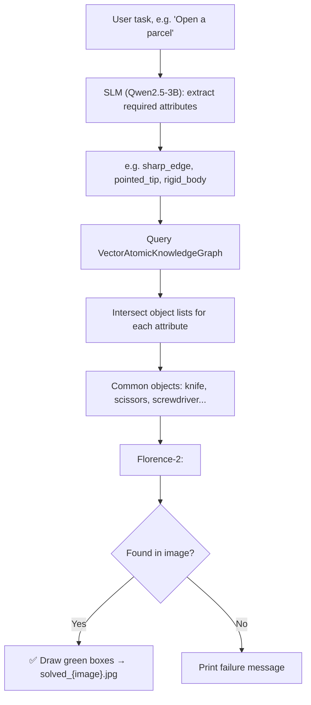
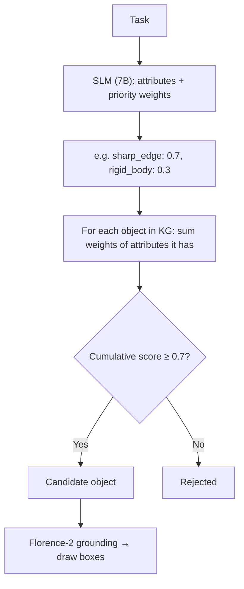

# 📁 graph_approach

⬅ [Back to Anshdeep_Singh overview](../README.md)

**What it does:** The core, current-generation system. Instead of asking a VLM to guess objects directly, it builds an **atomic, vector-based Knowledge Graph** that maps objects to their physical properties (`sharp_edge`, `rigid_body`, `hollow`, etc.), then reasons: *"what physical properties does this task need, and which objects in the graph have them?"* — before verifying visually with Florence-2.

> Older/superseded pipelines that led up to this design live in [`old/`](./old/README.md).

---

## `atomic_kg_builder.py` — the knowledge graph engine itself

Defines the **`VectorAtomicKnowledgeGraph`** class — the "brain" of the whole project.

- Backend is a JSON file (`vector_atomic_kg.json`) with two dictionaries: `objects` (object → list of attribute IDs) and `attributes` (attribute node → canonical name, aliases, 384-dim embedding, and reverse list of objects that have it).
- **Merge logic:** new attributes are embedded with `SentenceTransformer("all-MiniLM-L6-v2")`. Cosine similarity is checked against every existing attribute node — **≥ 0.75** merges into that node (as an alias); below that, a brand-new node is created. This prevents duplicate nodes like `sharp_edge` vs `sharp-edged` vs `has sharp edge`.
- **SLM-powered ingestion:** `extract_atomic_attributes()` lazily loads `Qwen/Qwen2.5-3B-Instruct` on **CPU** (`device_map="cpu"`, `bfloat16`) and asks it to break an object name (e.g. `"Kitchen Knife"`) into atomic traits (e.g. `["sharp_edge", "rigid_body", "metallic"]`), parsed out of the model's output via regex.
- Has a `__main__` runner that seeds the graph with 12 common objects (thermos, scissors, plunger, etc.) to demonstrate ingestion.



## `vector_atomic_kg.json` — the persistent graph database

- **53 objects** (e.g. `kitchen_knife`, `scissors`, `sword`) mapped to **112 unique attribute nodes**.
- Each attribute node stores its canonical name, aliases, its 384-float embedding vector, and every object that has it — enabling reasoning like *"find all objects with both `sharp_edge` and `rigid_body`."*

## `expand_graph.py` — automatic graph growth from images

- Loads **Florence-2 permanently on GPU** (small, ~0.5 GB).
- Loops over a hardcoded image range `range(11, 31)` (images `11.jpg`–`30.jpg`) in `../Open_Parcel/`.
- Runs Florence's `<DENSE_REGION_CAPTION>` to get raw object labels present in each image, deduplicates them, and for every **new** label (not already in the graph) calls `extract_atomic_attributes()` (SLM) and ingests it via `kg.add_object_with_attributes()`.
- This is an **offline/batch tool** — it doesn't run during task inference, it slowly builds up the graph's vocabulary over time from real images.



## `quantize_model.py` — model compression utility

- Downloads `Qwen/Qwen2.5-7B-Instruct` and quantizes it to **8-bit** using `BitsAndBytesConfig(load_in_8bit=True)`, loaded on `device_map="cpu"`.
- Saves the compressed model locally to `../Qwen-7B-8bit/` with `max_shard_size="1GB"` (splits it into manageable chunks).
- Sets `HF_HOME` to an external drive path so the ~14 GB of original weights don't fill the local disk.
- **Why it exists:** the 7B model (used by `vision_agent_v1.2_.py`) would instantly OOM a 6 GB GPU at full precision — this pre-quantization step makes it usable.

## `vision_agent.py` — the base reasoning agent (single image)

The clean, foundational implementation of Task → Attributes → Graph → Florence.


- SLM outputs a flat list of snake_case attributes.
- Graph lookup is a plain **set intersection**: an object must have *every* required attribute to qualify.
- Output: `solved_<image_name>.jpg` with green bounding boxes.

## `vision_agent_v1.1.py` — batch mode + bigger SLM, all-CPU

- Upgrades to `Qwen/Qwen2.5-7B-Instruct`, loaded **8-bit on CPU** (`DEVICE = "cpu"`) — a fully CPU-based reasoning pipeline.
- Instead of one image, takes a **folder path** and loops `for i in range(1, 201)` (images `1.jpg`–`200.jpg`).
- SLM attribute extraction and the graph query run **once**, then are reused across all 200 images — much more efficient than recomputing per image.
- Saves results to `annotated_results/`, logging `[+] Detected` / `[-] No objects` per image.

## `vision_agent_v1.2_.py` — weighted / scored reasoning

The most mathematically advanced version — moves from hard set-intersection to a **soft, weighted scoring system**.

- SLM (7B, 4-bit) outputs attributes **with priority weights** summing to 1.0, e.g.:
  ```json
  [{"attribute": "sharp_edge", "priority": 0.7}, {"attribute": "rigid_body", "priority": 0.3}]
  ```
- Graph lookup accumulates a **score per object**: an object gains an attribute's weight if it possesses that attribute. Only objects reaching **`SCORE_THRESHOLD = 0.7`** (70% cumulative weight) qualify as candidates.
- This allows partial matches — an object doesn't need *every* attribute, just enough weighted coverage.
- Image path and task query are **hardcoded** for testing (`img_path_str = "../Open_Parcel/1.jpg"`, `task_query = "Open a parcel"`) rather than taken as input.



---

## Files
| File | Role |
|---|---|
| `atomic_kg_builder.py` | Defines `VectorAtomicKnowledgeGraph`; SLM-based attribute extraction & merging |
| `vector_atomic_kg.json` | The graph data: 53 objects, 112 attribute nodes |
| `expand_graph.py` | Auto-expands the graph from images (Florence + SLM) |
| `quantize_model.py` | Pre-quantizes Qwen 7B to 8-bit for cheaper loading |
| `vision_agent.py` | Base single-image reasoning agent |
| `vision_agent_v1.1.py` | Batch (200 images), 7B SLM on CPU, 8-bit |
| `vision_agent_v1.2_.py` | Weighted/scored attribute matching, 7B SLM, hardcoded test task |

## Hardware Requirements
| File | Requirement |
|---|---|
| `atomic_kg_builder.py` / `expand_graph.py` | SLM on CPU (~6.5 GB RAM), Florence-2 on GPU (~0.5 GB) |
| `quantize_model.py` | Needs enough system RAM to load 7B model for quantization; run once, offline |
| `vision_agent.py` | GPU for Florence + SLM (3B, bfloat16) |
| `vision_agent_v1.1.py` | Fully CPU — 7B SLM in 8-bit needs substantial system RAM (16 GB+ recommended) |
| `vision_agent_v1.2_.py` | 7B SLM in 4-bit (GPU) + Florence-2 |

## Run
```bash
cd graph_approach
python vision_agent.py
# enter a task like: "open a parcel"
```