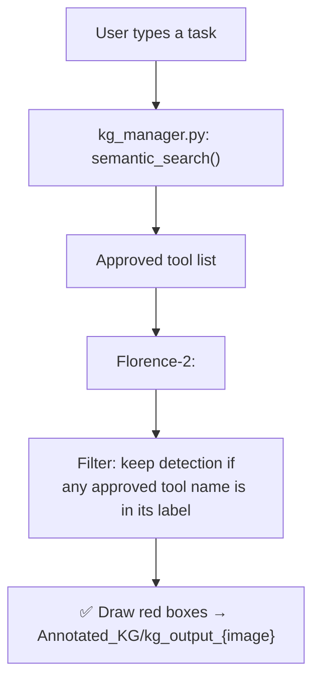
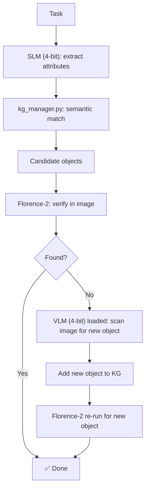

# 📁 graph_approach/old

⬅ [Back to graph_approach](../README.md) · [Back to Anshdeep_Singh overview](../../README.md)

**What it does:** Earlier iterations of the knowledge-graph and VLM-grounding idea, kept for reference. These pipelines led to the design used in the current `graph_approach/` files (especially `atomic_kg_builder.py` and `vision_agent.py`).

---

## `kg_manager.py` — the simple, pre-vector knowledge graph

- A **plain dictionary** mapping descriptive phrases (e.g. `"small handheld object with sharp blades"`) directly to a list of objects (e.g. `["scissors", "knife", "box cutter"]") — no attribute nodes, no merging.
- Uses `SentenceTransformer("all-MiniLM-L6-v2")` for `semantic_search()`: embeds the query, computes cosine similarity against every stored phrase, and returns the best match if similarity **≥ 0.80**.
- `load_graph()` seeds a default graph with 5 categories (cutting tools, containers, pry tools, absorbent materials, striking tools) if no file exists.
- **Limitation** this design was replaced for: it can't decompose composite properties (e.g. "sharp AND long") into separate reusable nodes — this is exactly what `atomic_kg_builder.py`'s vector graph was built to fix.

## `attribute_knowledge_graph.json` — data file for `kg_manager.py`

- The manually curated seed graph. Later entries (e.g. `"large rectangular stiff material with tape"`) were likely added dynamically by `kg_vlm_slm_florence_v1.py` when it discovered new objects (like tape/parcel material) during runs on the `Open_Parcel` dataset.

## `pipeline_with_kg.py` — simple KG + Florence pipeline

- Loops over every image in `Open_Parcel/`.
- Filtering is simple substring matching (`tool.lower() in label.lower()`), not embeddings — a rule-based baseline.
- No fallback and no graph updating — the "manual" precursor to `kg_vlm_slm_florence_v1.py`.

## `kg_vlm_slm_florence_v1.py` — the advanced, VRAM-optimized 3-model pipeline

The most complex file in the whole project — built to run on a strict **6 GB VRAM** budget.

- **`ModelManager` class**: dynamically swaps models on/off the GPU. Florence-2 (~0.5 GB) stays loaded permanently. The Qwen **VLM** and Qwen **SLM** are loaded one at a time in **4-bit NF4** quantization, used, then cleared from CUDA memory before the next is loaded.
- **Pipeline logic:**
  1. SLM extracts required physical attributes for the task (e.g. "drink water" → "hollow watertight container").
  2. Queries `kg_manager.py`'s graph for a semantic match → candidate objects (e.g. cup, glass, bottle).
  3. Florence-2 verifies these objects in the image.
  4. **Fallback:** if Florence finds none of them, the **VLM is loaded** to look at the image directly and propose a new usable object.
  5. If the VLM finds something new, it's **added back into the knowledge graph** under that attribute string, and Florence is re-run specifically for it.
- This dynamic learn-as-you-go loop is the most advanced reasoning behavior in the project.

## `florence.py` — standalone Florence-2 GUI test tool

- Opens a GUI file dialog to pick an image, then prompts the user to type a query (e.g. `"knife, fork, spoon"`).
- Uses `<CAPTION_TO_PHRASE_GROUNDING>`; **key detail:** handles both `'bboxes_labels'` and `'labels'` output keys since Florence's output format varies by version.
- Saves `output_with_boxes.jpg` — used for quick, ad-hoc manual verification of what Florence can and can't detect before wiring it into a larger pipeline.

## `qwen_vlm_pipeline.py` — VLM-only baseline (no bounding boxes)

- Loads `Qwen/Qwen2.5-VL-3B-Instruct`, uses `process_vision_info` (from `qwen_vl_utils`) to correctly convert local image paths into model input tensors.
- Asks a plain question ("What can I use to open a parcel?") and just **prints the model's raw text answer** — no bounding box extraction at all.
- Proof-of-concept "hello world" for the VLM's visual reasoning, before any grounding was added.

## `qwen_vlm_pipeline_v2.py` — VLM with text-parsed bounding boxes

- Adds `extract_box_data()`: a regex-based parser that pulls bounding boxes directly out of Qwen's **text output**, handling both a bracket-array format (`[0.36, 0.81, 0.54, 0.9]`) and a legacy tag format (`<|box_start|>(ymin,xmin),(ymax,xmax)<|box_end|>`).
- Auto-detects normalized (0–1) vs. 1000-point-grid coordinates and converts to real pixel coordinates using image width/height.
- Loops over images 1–5 with a hardcoded prompt, logs results to a CSV (image, prompt, label, pixel box).
- **Why this approach was dropped:** parsing bounding boxes out of free-form VLM text proved less precise/consistent than using Florence-2's dedicated detection head — this is why every later pipeline pairs the VLM with Florence instead of trusting VLM-drawn boxes directly.

## `hybrid_bounding_boxes_dataset.csv`

- A combined dataset logging detections from **both** Florence and Qwen side by side, with columns: `Image_Filename`, `Source` (Florence/Qwen), `Detected_Label`, `Bounding_Box`.
- Contains some duplicate rows (script was re-run and appended without dedup) — useful for comparing model strengths/weaknesses head-to-head.

---

## Files
| File | Role |
|---|---|
| `kg_manager.py` | Simple phrase → tool-list graph manager (pre-vector) |
| `attribute_knowledge_graph.json` | Data file for `kg_manager.py` |
| `pipeline_with_kg.py` | Simple KG + Florence pipeline, substring filtering |
| `kg_vlm_slm_florence_v1.py` | Full VRAM-optimized pipeline w/ dynamic KG learning |
| `florence.py` | Standalone Florence-2 GUI test tool |
| `qwen_vlm_pipeline.py` | VLM-only baseline, text answer only |
| `qwen_vlm_pipeline_v2.py` | VLM + regex-parsed bounding boxes from text |
| `hybrid_bounding_boxes_dataset.csv` | Combined Florence vs Qwen detection log |

## Hardware Requirements
| File | Requirement |
|---|---|
| `kg_vlm_slm_florence_v1.py` | ~6 GB VRAM total via model swapping + 4-bit NF4 |
| `qwen_vlm_pipeline.py` / `_v2.py` | GPU for Qwen VLM (`device_map="auto"`) |
| `florence.py` | GPU or CPU, Florence-2 only (~0.5 GB) |
| `pipeline_with_kg.py` | GPU for Florence-2 only |