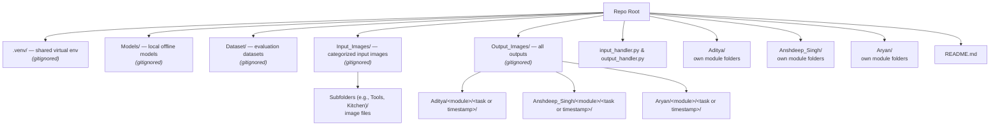

# 🧠 Task-Driven Object Detection on Embedded Devices

> A Research Methodology (RM) course project on task-based object detection using a knowledge graph — built for resource-constrained, offline devices like the Raspberry Pi.

This repository holds the Python pipeline code for **Aditya**, **Anshdeep_Singh**, and **Aryan**.

**Structural note:** This repo folder is the absolute root of the project. Shared assets — the virtual environment, models, datasets, and input/output images — live directly inside this folder but are strictly **excluded from GitHub** via `.gitignore`.

---

## 📑 Contents

* [About the Project](#-0-about-the-project)
* [Folder Structure](#-1-folder-structure-repo-root)
* [First-Time Setup](#-2-first-time-setup)
* [Running Code](#-3-running-code)
* [Converting Your Own Code to Fit This Structure](#-4-converting-your-own-code-to-fit-this-structure)
* [Do's and Don'ts](#-5-dos-and-donts)
* [Troubleshooting](#-6-troubleshooting)
* [Team](#-7-team)
* [License](#-8-license)

---

## 📌 0. About the Project

> **Problem statement:** How can we enable a resource-constrained device (like a Raspberry Pi) to intelligently identify objects in an image that can be used to perform a specific human task, using only local, offline AI models?

**Why it matters**

* 🦯 Assistive technology — helping visually impaired individuals identify tools
* 🤖 Robotics — helping a robot choose the right tool for a job
* 🏡 Independent living / elderly care
* 📚 Education — tool safety and object recognition

**Approach:** Each member explores their own combination of models/approaches under their own set of module folders, all standardized to the same input/output format using shared repository-level handler scripts, so results are directly comparable.

**Target deployment:** Raspberry Pi (resource-constrained, offline).

---

## 🗂️ 1. Folder Structure (Repo Root)



**Rule of thumb:** Everything is inside the repo root. Assets that are too large or dynamically generated (images, models, datasets, venv) are ignored by git. Everything that is *code* (and small config/JSON files like knowledge graphs) lives in your own member folder or at the repository root.

Each member's folder follows the same pattern:

```text
<Your_Name>/
├── <Module_1>/
│   ├── script1.py
│   ├── script2.py
│   └── config_or_kg.json
├── <Module_2>/
│   └── ...
└── <Module_N>/
    └── ...
```

---

## ⚙️ 2. First-Time Setup

1. Clone this repository to your local machine:

```bash
git clone https://github.com/AdityaSirsalkar001/Task-Driven-Object-Detection.git
cd Task-Driven-Object-Detection
```

2. Create the gitignored asset folders if they don't already exist:

```bash
mkdir Input_Images Output_Images Models Dataset
```

3. Set up the shared virtual environment:

```bash
python -m venv .venv
source .venv/bin/activate      # Windows: .venv\Scripts\activate
pip install -r requirements.txt
```

4. Populate `Input_Images/` with the necessary subfolders and image files for testing.

---

## ▶️ 3. Running Code

Always run scripts from the repo root directory with the virtual environment activated. The input and output handlers rely on this execution context.

```bash
source .venv/bin/activate
python <Your_Name>/<Module_Name>/<script>.py
```

**Example:**

```bash
python Aditya/Graph_Approach/pipeline_with_kg.py
```

---

## 🔁 4. Converting Your Own Code to Fit This Structure

We no longer use manual `.parent.parent` path calculations. All file reads and writes must go through `input_handler.py` and `output_handler.py` located at the repository root.

* **Read** input images by calling `input_handler.select_directory()`
* **Write** output images by calling `output_handler.get_output_dir(team_member, module_name, user_query)`

The easiest way to update your old scripts is to paste the prompt below into an LLM along with your Python file, and it will rewrite the file I/O operations automatically.

<details>
<summary><strong>📋 Click to expand: LLM conversion prompt</strong></summary>

````text
Please update my Python pipeline script to adapt to our new repository folder structure.

### 1. New Folder Structure
Everything, including gitignored assets, now lives inside this single repo root folder.

<Repo Root>/
├── .venv/                          # (Gitignored)
├── Dataset/                        # (Gitignored)
├── Input_Images/                   # (Gitignored) Contains subfolders of images
├── Output_Images/                  # (Gitignored)
│   ├── Aditya/
│   ├── Anshdeep_Singh/
│   └── Aryan/
├── Models/                         # (Gitignored)
├── Aditya/                         # Team member code folder
│   ├── <Module_Folder>/
│   │   └── pipeline.py             <-- Files like the one you are updating
├── Anshdeep_Singh/                 # Team member code folder
├── Aryan/                          # Team member code folder
├── input_handler.py                # Helper script at repo root
├── output_handler.py               # Helper script at repo root
└── .gitignore                      # Ignores Input/, Output/, Output_Images/, Models/

### 2. The Helper Scripts
Do not write custom path-resolution logic (like `Path(__file__).parent.parent...`) in my pipeline scripts anymore. Instead, you must import and use the following two helper scripts located at the repository root.

**A. input_handler.py** (Selects input directory)
```python
from pathlib import Path
target_dir = Path(__file__).resolve().parent / "Input_Images"

def select_directory():
  # Lists subdirectories in target_dir, prompts user to choose one, returns absolute path string
  # ... (Assume standard implementation)
```

**B. output_handler.py** (Creates and returns output directory)
```python
from pathlib import Path
from datetime import datetime
import re

REPO_ROOT = Path(__file__).resolve().parent
OUTPUT_BASE_DIR = REPO_ROOT / "Output_Images"

def get_output_dir(team_member: str, module_name: str, user_query: str = None) -> str:
    # Generates: <Repo Root>/Output_Images/<team_member>/<module_name>/<task_or_timestamp>/
    # ... (Assume standard implementation that auto-creates folders)
```

### 3. Your Task
For the Python file I provide, you must:

1. **Identify the author and module:** Look at where the file belongs (e.g., `Anshdeep_Singh` and `stages`) based on my prompt, or infer it from the old code.
2. **Import the handlers:** Add the necessary `sys.path` append logic to import `input_handler` and `output_handler` from the repo root.
3. **Update Input Logic:** Replace any hardcoded input paths (e.g., `./images`, `Open_Parcel/`) with a call to `input_handler.select_directory()`. Iterate through the images in the returned directory.
4. **Update Output Logic:** Replace any hardcoded output paths with a call to `output_handler.get_output_dir(team_member, module_name, user_query)`. Save all generated images/JSONs to this returned path.
5. **Preserve the Core:** **DO NOT** alter the AI models, inference logic, knowledge graph structure, thresholds, or standard processing steps. Only touch file I/O operations.
6. **Comment Changes:** Mark every line you change with `# [PATH CHANGE]`.

Provide the complete updated Python code in your response. Do not omit any core functionality. I will provide the script to modify next.
````

</details>

This works regardless of whether your old script used a different folder layout entirely, manual `../..` path climbing, or hardcoded absolute paths — the prompt asks the LLM to infer your author/module from context and rewire only the I/O.

---

## ✅ 5. Do's and Don'ts

| ✅ Do | ❌ Don't |
| --- | --- |
| Put your code (scripts, module-local JSON/config files) inside `<Your_Name>/<Module_Name>/` | Commit images, datasets, or models to the repo |
| Use `input_handler.py` to read images | Commit `.venv/` |
| Use `output_handler.py` to write output images | Manually calculate folder depths with `..` in your scripts |
| Use the provided LLM prompt to port old code | Touch other members' folders |

---

## 🛠️ 6. Troubleshooting

| Problem | Likely Cause | Fix |
| --- | --- | --- |
| `ModuleNotFoundError: input_handler` | Script run from wrong directory, or `sys.path` missing repo root | Run from repo root, or check the `sys.path.append` line the conversion prompt adds |
| `Input_Images/` folder shows no subdirectories | Folder created but empty | Populate it with your own category subfolders and images (gitignored, not tracked) |
| Output files not appearing where expected | Old hardcoded path still in script | Re-run the conversion prompt from [Section 4](#-4-converting-your-own-code-to-fit-this-structure) on that file |
| `pip install -r requirements.txt` fails | Virtual environment not activated | Run `source .venv/bin/activate` (or `.venv\Scripts\activate` on Windows) first |

---

## 👥 7. Team

| Member | Repo Folder |
| --- | --- |
| Aditya | `Aditya/` |
| Anshdeep Singh | `Anshdeep_Singh/` |
| Aryan | `Aryan/` |

---

## 📄 8. License

This project is licensed under the **MIT License** — a short, permissive open-source license. In plain terms: anyone can use, copy, modify, and share this code (including for commercial purposes), as long as they keep the original copyright notice. It places no warranty obligation on the authors and is one of the most common licenses for course/academic and small open-source projects. Add a `LICENSE` file with the standard MIT text to the repo root to make it official.